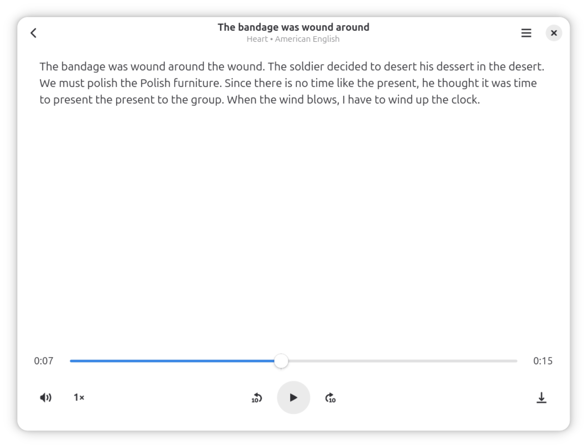
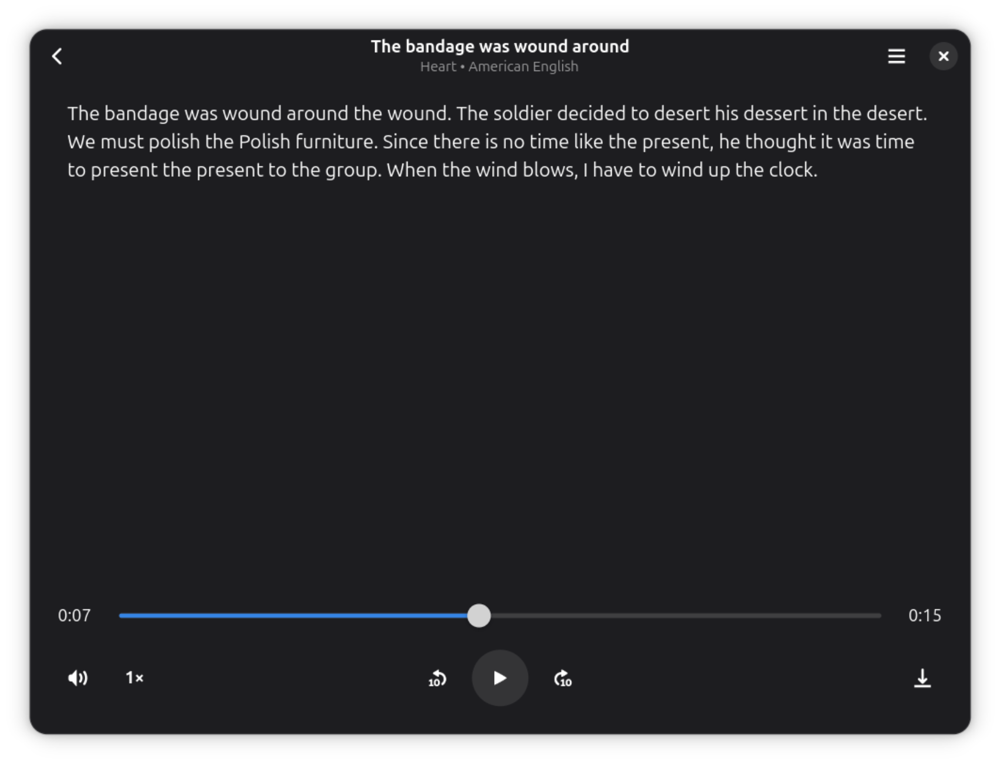

# Parrot

A text-to-speech reader for the GNOME desktop powered by [Kokoro](https://huggingface.co/hexgrad/Kokoro-82M).

## Features

- Open documents directly or paste text manually
- Multiple voices across several languages (American English, British English, Spanish, French, Hindi, Italian, Japanese, Portuguese, Chinese)
- Playback controls: play/pause, seek, rewind/forward 10s, speed (0.5× – 2×), volume
- Export generated audio

## Screenshots

| Player | Dark Mode |
|:---:|:---:|
|  |  |

## Building

Requires [GNOME Builder](https://apps.gnome.org/Builder/) and the GNOME Platform Flatpak runtime.

1. Clone the repository:
   ```sh
   git clone https://github.com/codebyahmed/parrot-reader.git
   cd parrot-reader
   ```
2. Open the project folder in GNOME Builder
3. Click **Run**
